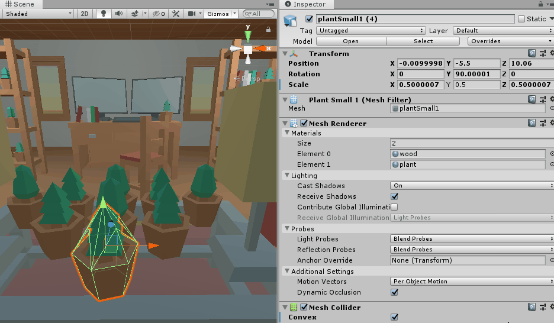

# "Bowling" Game Continued

## Introduction

We're going to continue working on our "bowling" game that we started. Last time, we create a player that can look around a world that we built with Kenney's furniture asset pack. Now, we're going to extend it:

- Give the player the ability to throw projectiles at our scene. They'll have a limited supply of stuff to throw around, so they are going to try to knock as many things around as they can with as few throws as possible.
- Track the objects in our scene that fall off tables/desks and land on the floor. For each one that hits the floor, this will count as a point.

This will all involve applying old concepts in new ways, along with learning some new Unity concepts.

## Setup

You can work from your project from last week, or start a new project. Either way, download the starter files from canvas and import it into your project. (There are some additional assets in there for this tutorial that weren't in last week's starter files.) There is a sample scene in there, with a player that uses the "MouseLook" script from last time.

## Throwing

### Create Something Throwable

We've seen that you can "throw" things from Create with Code. In Unit 2, we instantiated a projectile prefab and using `transform.Translate` to move it forward. That works for certain games, but in our case, we want to be able to throw something around a 3D room. If we just use `Translate`, that object is going to fly straight forward and never fall to the ground - not terribly realistic. We want a nice arc that follows the rules of physics: 


When we want something to act under the laws of physics, we need to give it a `Rigidbody` component and use methods that live on the `Rigidbody` class to apply forces to move the object. So to start with, we need to create a prefab that is configured for physics:

- Grab a food model from "Assets/Kenney/Food Kit FBX" and drag it into your scene.
- Add a Rigidbody component to it.
- Make sure that the Mesh Collider component's "Convex" setting is checked. Unity does not support non-convex Rigidbody colliders. Checking "Convex" creates a new [convex hull](https://medium.com/@pascal.sommer.ch/a-gentle-introduction-to-the-convex-hull-problem-62dfcabee90c) around the object that can be used for collision detect. See green outline in the below GIF - that's the convex hull:


If you hit play and that food drops to the floor and lands on it, you've got it set up correct. Once it works, turn it into a prefab by creating a folder called "Prefabs" and then dragging the food object from your scene into that folder. (If it asks if you want to create a new original prefab or a prefab variant, either work for this project.)

### Instantiating and Throwing

Now that we've got something throwable as a prefab, we can write a script that actually does the throwing. Create a new "Throw" script, and since we want the player to do the throwing, attach it to your player (main camera). 

We're going to hook up the throw to the left mouse button, so to start let's just verify that we can detect when the left mouse button is clicked using an if statement:

```cs
void Update()
{
    // 0 = primary, 1 = secondary, 2 = middle
    if (Input.GetMouseButtonDown(0))
    {
        Debug.Log("Throwing!");
    }
}
```

Run it and check your console - every time you left click, you should see "Throwing!" print to the console window. Now that we've got that working, we can actually spawn a projectile:

```cs
// We don't want to use public to expose a field in the inspector, we want to 
// use SerializeField:
[SerializeField] GameObject projectile;

void Update()
{
    if (Input.GetMouseButtonDown(0))
    {
        // See the docs, but this generates a random rotation:
        Quaternion randomRotation = Random.rotationUniform;

        // Spawn at the camera's position, but move 0.5m in the camera's forward direction (the way 
        // it is facing). This makes it so that the projectile doesn't spawn inside the camera and
        // end up getting clipped. Remember - the camera has a near and far clipping plane beyond
        // which it can't see things.
        Vector3 spawnPosition = transform.position + transform.forward * 0.5f;

        // Create an instance of the prefab in the world.
        GameObject projectileInstance = Instantiate<GameObject>(projectile, spawnPosition, randomRotation);
    }
}
```

Since we've used the `[SerializeField]` attribute on the projectile field, we can fill in that field in the inspector. Drag and drop your food projectile prefab into the "projectile" field in the inspector. Test and run. Your food should just drop down in front of the camera. 

To make the food that we are spawning in fly forward, we need to talk to its `Rigidbody`. To use methods/fields/properties of another component, we need to use `GetComponent<>`:

```cs
// Create an instance of the prefab in the world.
GameObject projectileInstance = Instantiate<GameObject>(projectile, spawnPosition, randomRotation);

// Get access to the instance's rigidbody.
Rigidbody rb = projectileInstance.GetComponent<Rigidbody>();

// Apply a force in the camera's forward direction (the direction it is pointing).
rb.AddForce(transform.forward * 20, ForceMode.Impulse);
```

Here we apply a force in the camera's forward (postive z) direction. When we take a `Vector3` and multiply it by a number (`transform.forward * 20`) we are scaling that Vector3. E.g. if the original vector were (0, 0, 1), it would now be (0, 0, 10). [ForceMode](https://docs.unity3d.com/ScriptReference/ForceMode.html) controls how that force is applied. `ForceMode.Impulse` adds "an instant force impulse to the rigidbody, using its mass" so the projectile's mass will be taken into account.

This is really close! Try turning up the force by increasing from 20 to 40. What happens? The food flies forward and falls, but doesn't really arc up like a ball would if you threw it in real life.

```cs
// Figure out a direction that is still pointing forward from the camera, but rotated upward by
// 10 degrees.
float upwardArcAngle = Mathf.Deg2Rad * 10;
Vector3 direction = Vector3.RotateTowards(transform.forward, Vector3.up, upwardArcAngle, 0);

// Apply a force in the camera's forward direction (the direction it is pointing).
rb.AddForce(direction * 20, ForceMode.Impulse);
```

Right now, our code has "magic numbers" that are hard-coded in the script. There's no way to adjust the force of the throw or the upward tilt of the throw without touching the code. Our script would be much improved if we could tweak those from the editor, which lets us (or gameplay designers) find the sweet spot for those settings:

```cs
public class Throw : MonoBehaviour
{
    // We don't want to use public to expose a field in the inspector, we want to 
    // use SerializeField:
    [SerializeField] private GameObject projectile;
    [SerializeField] private float throwStrength = 20;
    [SerializeField] private float upwardArcInDegrees = 10;

    // ... code omitted
}
```

Tweak those values from your inspector and find a set of values that feels good to you.

### Hitting Things

Whew, now we can throw food around the world... but nothing happens if that projectile hits something in our scene. The goal is to knock things on the ground, so we need: 1) objects in the world to respond when hit with the projectile, 2) detect collisions when objects in the world hit the ground.

To start, make sure to:
- Create a floor (either a big plane, or using the floor models from Kenney).
- Add a table to your scene, within throwing distance of the player.
- Place a plant on top of the table.
- Add a rigidbody to the plant and make sure its colliders is set to be convex.

Test and run - you should now be able to throw things at the plants and have them fall off the table. Now, we can start scripting. Add a "CollisionTracker" script and put it on one of the plants. Inside of that script:

```cs
private void OnCollisionEnter(Collision collision)
{
    // The Collision class tells us about the collision, including which objects were 
    // involved, where exactly they collided with one another.

    // Get the "other" game - the one with which the plant collided.
    GameObject other = collision.gameObject;

    // Inside of a script, we can use "gameObject" to get access to the game object 
    // to which the script is attached. All GameObjects have a name property.
    Debug.Log($"{gameObject.name} just hit {other.name}.");
}
```

Any time the plant collides with anything, `OnCollisionEnter` is called. If you run the game, throw something at the plant and check your console, you might see something vaguely like:

```
plantSmall1 just hit tableCoffeeGlass 
plantSmall1 just hit tomato 
plantSmall1 just hit floorFull 
```

The plant collides with the table it is sitting on, then the plant collides with the tomato projectile and then the plant collides with the floor after it falls off the table. We only care about that last collision, so we need some to filter our collision. We _could_ use the name, but we probably have different named objects that could count as the ground (e.g. "floorFull (1)", "floorFull (2)", "rugRounded"). A better solution is to use the tagging system built in to Unity. With tags, we can label a whole bunch of objects as "ground" and then we can check the tag in `OnCollisionEnter`.

Here's how we can create a new "Ground" tag and apply it to one of the plants on the table:



Now if we modify that script to use a conditional:

```cs
private void OnCollisionEnter(Collision collision)
{
    GameObject other = collision.gameObject;
    //Debug.Log($"{gameObject.name} just hit {other.name}.");

    if (other.CompareTag("Ground"))
    {
        Debug.Log($"{gameObject.name} just hit the ground.");
        Destroy(gameObject);
    }
}
```

It should only print out when the plant hits the ground, and when it does, the plant should get destroyed and disappear from the world.

Now, let's add a poof of smoke when the plant get destroyed. We're going to use a particle system for that. We'll learn more about them in Create with Code, but for now, look in the "Particles" folder with the "Prefabs" folder. Drag "CFX3_Hit_SmokePuff" into your scene to see it in action. When you are done, you can remove it from the scene.

We want to modify our script to create that prefab at the place where the plant hit the ground:

```cs
[SerializeField] GameObject cloudParticles;

private void OnCollisionEnter(Collision collision)
{
    GameObject other = collision.gameObject;
    //Debug.Log($"{gameObject.name} just hit {other.name}.");

    if (other.CompareTag("Ground"))
    {
        // Debug.Log($"{gameObject.name} just hit the ground.");
        ContactPoint contact = collision.GetContact(0);
        Instantiate(cloudParticles, contact.point, cloudParticles.transform.rotation);
        Destroy(gameObject);
    }
}
```

Make sure to set the "cloudParticles" field in the inspector. When you test and run, the plant should disappear into a puff of smoke. Duplicate the plant a few times in your scene, so that there are bunch on the table. Each should be able to be knocked off and destroyed now.

## Extensions

Now that you've got something basic working, implement the following:

- When the player throws something, make it a random food instead of the same food every time.
- Limit the number of projectiles the player can throw.
- (Optional, but recommended) Can you figure out how to restart the scene when the player presses "R"?

## Next Time

- Tracking the score.
- Adding the user interface.
- Limiting


<!-- 
You should see something like 


Add a table with a couple objects
Then build out your world

- Fill the world with objects
- Add a collider to all of them
- Add script to all of them
- Organize with empties
- Create a new tag called "Ground"
- Tag all the floor objects (including rug) as the ground
- Detect collisions with ground
- Destroy gameobject
- Spawn particles at contact point

### Tracking the Score

## Extensions

- Instead of spawning the same projectile each time, make it so that you throw a random projectile chosen from an array of options.
- Display the number of projectiles left on the screen.
- Delay between shots?
- Limit the number of times the player can shoot


- Detecting collisions
  - Add a new tag for "Movable Objects"
  - Apply the tag to all GOs
  - Layers vs Tags
    - https://docs.unity3d.com/Manual/class-TagManager.html
    - Tags are more general purpose
    - Layers allow selective rendering and/or selective collisions
  - Add a new tag for "Ground"
  - Apply to all floor tiles
    - You can search for "floor" and then drag to select


## Physic Materials

Physic Materials control what happens when two physical bodies collide with in Unity. They specifically control the friction and bounciness of collisions. First, check out these resources:

- Watch this Unity video on [Physic Materials](https://www.youtube.com/watch?v=SuUNnwswH94).
- Read the Unity page on [Physic Materials](https://docs.unity3d.com/Manual/class-PhysicMaterial.html).

Now, add a "Basketball" material to your ball prefab and give it a bounciness of 1. What happens? It looks a little more "realistic" because the ball doesn't just thud and stop when it hits objects in the world. It also is incredibly hard to play the game because the ball bounces super far after hitting the backboard. 

In a game like we have, we probably want the ball to be really bouncy when it hits ground, but not so bouncy when it hits the background. When two physics objects collide, the amount of bounce that is applied determined by each object's "Bounciness" and "Bounce Combine" settings.

Review the documentation again and try to get a weak bounce for ball vs backboard collisions but a strong bounce for ball vs. ball and ball vs. court.

## Animated Fade

Our DestroyBall script destroys thrown basketballs after 6 seconds or when the balls falls off the court. This is an important optimization so that we don't end up with thousands of ball game objects in the scene as the player tries to rack up a high score.

Our current code leaves something to be desired though. The ball suddenly disappears when it is destroyed, which can be jarring. In general, you want to create transitions that give the player feedback about what is happening (e.g. a 2D character blinking when it is hit by an enemy). We're going to update the script so that the ball fades.

Check out the Ball material we created last time. It uses the "Standard Shader" which is Unity's built-in shader that tries to cover a lot of use cases - from metals to grass to cloth. The only parameter we are using currently is the "Albedo" color. We set it to an orangish color.

Read the following:

- [Unity manual on the standard shader material](https://docs.unity3d.com/Manual/shader-StandardShader.html)
- [Unity manual on the Standard Shader's parameters](https://docs.unity3d.com/Manual/StandardShaderMaterialParameters.html)
- [Unity manual on the Albedo Color and Transparency settings](https://docs.unity3d.com/Manual/StandardShaderMaterialParameterAlbedoColor.html)
 
We now want to make the ball transparent:

- Click on the material and look at its setting in the editor.
- For the "Rendering Mode" dropdown, select the "Fade" option. This lets us render materials using opacity.
- Click on the Albedo color selector. Check out the "A" slider. This is the alpha slider. A value of 0 is transparent and a value of 255 is opaque.

Try setting the alpha to something like 127 and then running the game. You should be throwing translucent basketballs.

Now, set the alpha back to 255. We are going to use code to manipulate that alpha value, slowly turning the basketball to fully transparent. 

To start, let's see how we can manipulate the color via code. In the DestroyBall script, add the following to your destroy method:

```cs
Material mat;

void Start()
{
    // Get the Renderer attached to this game object.
    Renderer renderer = GetComponent<Renderer>();
    // Get the material the renderer is using.
    material = renderer.material;
    // Set the color to something blue and semi-transparent.
    material.color = new Color(0f, 1f, 0f, 0.5f);
}
```

Run the game and you should be shooting translucent green basketballs. Check out the [documentation for color](https://docs.unity3d.com/ScriptReference/Color.html). The constructor takes four values - red, green, blue and alpha - which are between 0 and 1. 

Green basketballs are not exactly what we want, but that's easy to fix. Comment out the line that sets the color to blue and try:

```cs
// Generate a semi-transparent basketball color.
Color newColor = Color.Lerp(material.color, new Color(0f, 0f, 0f, 0f), 0.5f);
// Apply it to the material.
material.color = newColor;
```

Read the [Color.Lerp documentation](https://docs.unity3d.com/ScriptReference/Color.Lerp.html). It allows us to generate a color that is between two colors. Here, we are saying that we want the basketball to be halfway between the current color and a fully transparent black color.

Aha, so now, if we Lerp by a small amount each frame, we've got an animation! Try moving your code to `Update` and lowering the third argument to something like 0.05f. Now we can start to put everything together. 

Instead of fading when the script starts up, we want it to start fading after 6 seconds or when the ball has fallen off the court. Try implementing that logic yourself. If you get stuck, refer to the possible solution below:

```cs
Material material;
bool isFading = false;
[SerializeField] float fadeSpeed = 10f;

void Start()
{
    // Get the Renderer attached to this game object.
    Renderer renderer = GetComponent<Renderer>();
    // Get the material the renderer is using.
    material = renderer.material;
    
    // Set the color to something blue and semi-transparent.
    //material.color = new Color(0f, 1f, 0f, 0.5f);
    
    // Generate a semi-transparent basketball color.
    Color newColor = Color.Lerp(material.color, new Color(0f, 0f, 0f, 0f), 0.5f);
    // Apply it to the material.
    material.color = newColor;

    // Schedule the fade out as soon as the ball is created, so that we don't accumulate
    // a whole bunch on top of the court.
    Invoke("StartFading", 6);
}

void StartFading()
{
    isFading = true;
}

void Update()
{
    if (transform.position.y < -20)
    {
        StartFading();
    }

    if (isFading)
    {
        // Generate the new, slightly more transparent color and apply it to the ball.
        float fadeAmount = fadeSpeed * Time.deltaTime;
        Color newColor = Color.Lerp(material.color, Color.clear, fadeAmount);
        material.color = newColor;
        
        // When we've reached the end of the animation (fully transparent), destroy!
        if (material.color == Color.clear)
        {
            Destroy(gameObject);
        }
    }
}
```

## Tracking the Score

To track the score, we need some way to determine when the ball passes through the hoop. There are a few ways that we could do this in Unity, but one easy way is to use an invisible collider as a trigger.

Before we begin, watch the "Colliders" and "Colliders as Triggers" video tutorials on [this page](https://learn.unity.com/tutorial/3d-physics).

1. Create an empty game object called "Score Tracker" in your scene.
2. Add a "Sphere Collider" component to it and mark it as a trigger. When you select the Score Tracker from the hierarchy, you should now see a green outline.
3. Move the game object so that it is roughly inside of the basketball hoop. You might want to adjust the scale to make sure the collider is completely within the hoop.
4. Make the Score Tracker game object a child of the Post game object (by clicking and dragging). This means that when the post moves, the Score Tracker will follow.
5. Create a new script called "ScoreManager" and attach it to the Score Tracker.
6. Using OnTriggerEnter, print out a message to the console when a ball passes through the hoop.

## Adding a User Interface

User interfaces (UIs) are a bit topic unto themselves, but we can quickly get a scoreboard up and running. First, some background knowledge: 

- Watch [this tutorial](https://www.youtube.com/watch?v=wlY5sRewfVQ) on creating text
- Read [this page](https://docs.unity3d.com/Manual/UICanvas.html) on how the canvas works in Unity. We're going to be using the "Screen Space - Overlay" rendering option.
- Read [this page](https://docs.unity3d.com/Manual/UIBasicLayout.html) on how to lay out UI components. They are a bit different than 3D game objects. 

Now, let's create some text:

1. Right click in you Hierarchy and choose "UI" => "Text" in the menu. This will create a Canvas object, a Text object and an EventSystem object.
2. Click on the text object and set it's contents to be "Score: 0". Change the color to be something that will be visible on our space background, like white.
3. Position the text on screen so that it is in on of the corners of the game view. (For position, it can be helpful to switch to isometric view and double click on the Canvas to focus on it.)

Perfect, now we just need to use scripting to update the text when the player scores a point. We're going to be working within our ScoreManager script again.

First, we want to get a reference to the Text component:

```cs
using UnityEngine.UI;

public class ScoreManager : MonoBehaviour
{
    [SerializeField] Text scoreText;

    // ...code omitted
}
```

This will create a field in our inspector (on the Score Tracker game object) that we can drag and drop our "Text" game object into. Go ahead and do that.

After you've got that working, you can simply set the text in `OnTriggerEnter`:

```cs
[SerializeField] Text scoreText;
int score = 0;

void OnTriggerEnter(Collider other)
{
    score += 1;
    Debug.Log(score);
    scoreText.text = "Score: " + score;
}
```
  
## Submitting

To submit:
- Upload a screenshot of your project running.
- Zip up your project folder and submit it to canvas. See [screencast](https://canvas.colum.edu/courses/11667/pages/uploading-a-unity-zip-to-canvas?module_item_id=433343). -->