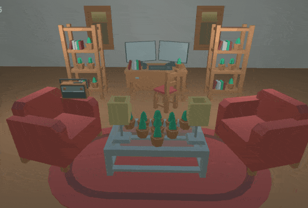
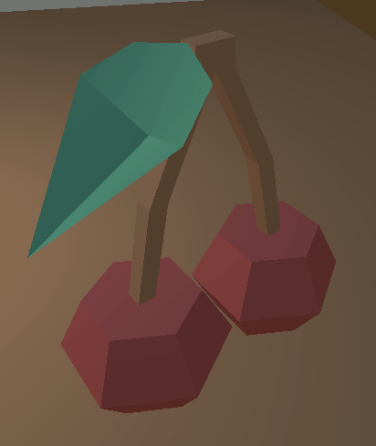
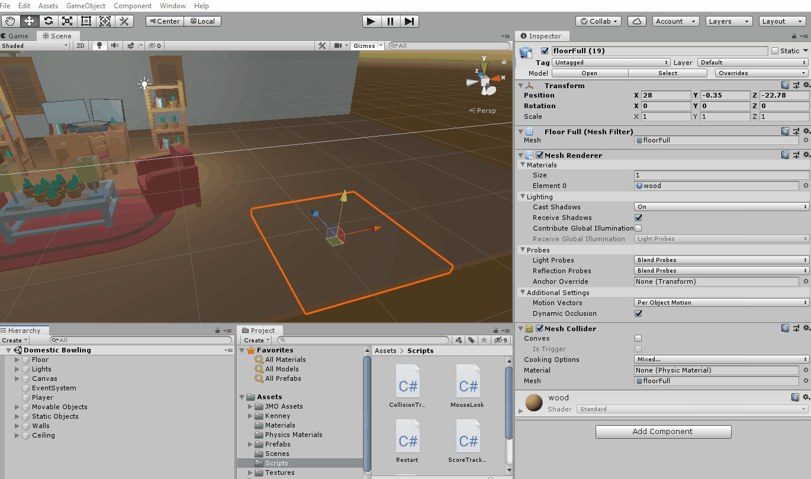

# "Bowling" Game Continued

## Introduction

We're going to continue working on our "bowling" game that we started. Last time, we create a player that can look around a world that we built with Kenney's furniture asset pack. Now, we're going to extend it:

- Give the player the ability to throw projectiles at our scene. They'll have a limited supply of stuff to throw around, so they are going to try to knock as many things around as they can with as few throws as possible.
- Track the objects in our scene that fall off tables/desks and land on the floor. For each one that hits the floor, this will count as a point.

This will all involve applying old concepts in new ways, along with learning some new Unity concepts.

The version of the game from the tutorial might look like:



## Setup

You can work from your project from last week, or start a new project. Either way, download the starter files from canvas and import it into your project. (There are some additional assets in there for this tutorial that weren't in last week's starter files.) There is a sample scene in there, with a player that uses the "MouseLook" script from last time.

## Throwing

### Create Something Throwable

We've seen that you can "throw" things from Create with Code. In Unit 2, we instantiated a projectile prefab and using `transform.Translate` to move it forward. That works for certain games, but in our case, we want to be able to throw something around a 3D room. If we just use `Translate`, that object is going to fly straight forward and never fall to the ground - not terribly realistic. We want a nice arc that follows the rules of physics: 


When we want something to act under the laws of physics, we need to give it a `Rigidbody` component and use methods that live on the `Rigidbody` class to apply forces to move the object. So to start with, we need to create a prefab that is configured for physics:

- Grab a food model from "Assets/Kenney/Food Kit FBX" and drag it into your scene.
- Add a Rigidbody component to it.
- Make sure that the Mesh Collider component's "Convex" setting is checked. Unity does not support non-convex Rigidbody colliders. Checking "Convex" creates a new [convex hull](https://medium.com/@pascal.sommer.ch/a-gentle-introduction-to-the-convex-hull-problem-62dfcabee90c) around the object that can be used for collision detect. See green outline in the below GIF - that's the convex hull:



If you hit play and that food drops to the floor and lands on it, you've got it set up correct. Once it works, turn it into a prefab by creating a folder called "Prefabs" and then dragging the food object from your scene into that folder. (If it asks if you want to create a new original prefab or a prefab variant, either work for this project.)

### Instantiating and Throwing

Now that we've got something throwable as a prefab, we can write a script that actually does the throwing. Create a new "Throw" script, and since we want the player to do the throwing, attach it to your player (main camera). 

We're going to hook up the throw to the left mouse button, so to start let's just verify that we can detect when the left mouse button is clicked using an if statement:

```cs
void Update()
{
    // 0 = primary, 1 = secondary, 2 = middle
    if (Input.GetMouseButtonDown(0))
    {
        Debug.Log("Throwing!");
    }
}
```

Run it and check your console - every time you left click, you should see "Throwing!" print to the console window. Now that we've got that working, we can actually spawn a projectile:

```cs
// We don't want to use public to expose a field in the inspector, we want to 
// use SerializeField:
[SerializeField] GameObject projectile;

void Update()
{
    if (Input.GetMouseButtonDown(0))
    {
        // See the docs, but this generates a random rotation:
        Quaternion randomRotation = Random.rotationUniform;

        // Spawn at the camera's position, but move 0.5m in the camera's forward direction (the way 
        // it is facing). This makes it so that the projectile doesn't spawn inside the camera and
        // end up getting clipped. Remember - the camera has a near and far clipping plane beyond
        // which it can't see things.
        Vector3 spawnPosition = transform.position + transform.forward * 0.5f;

        // Create an instance of the prefab in the world.
        GameObject projectileInstance = Instantiate<GameObject>(projectile, spawnPosition, randomRotation);
    }
}
```

Since we've used the `[SerializeField]` attribute on the projectile field, we can fill in that field in the inspector. Drag and drop your food projectile prefab into the "projectile" field in the inspector. Test and run. Your food should just drop down in front of the camera. 

To make the food that we are spawning in fly forward, we need to talk to its `Rigidbody`. To use methods/fields/properties of another component, we need to use `GetComponent<>`:

```cs
// Create an instance of the prefab in the world.
GameObject projectileInstance = Instantiate<GameObject>(projectile, spawnPosition, randomRotation);

// Get access to the instance's rigidbody.
Rigidbody rb = projectileInstance.GetComponent<Rigidbody>();

// Apply a force in the camera's forward direction (the direction it is pointing).
rb.AddForce(transform.forward * 20, ForceMode.Impulse);
```

Here we apply a force in the camera's forward (postive z) direction. When we take a `Vector3` and multiply it by a number (`transform.forward * 20`) we are scaling that Vector3. E.g. if the original vector were (0, 0, 1), it would now be (0, 0, 10). [ForceMode](https://docs.unity3d.com/ScriptReference/ForceMode.html) controls how that force is applied. `ForceMode.Impulse` adds "an instant force impulse to the rigidbody, using its mass" so the projectile's mass will be taken into account.

This is really close! Try turning up the force by increasing from 20 to 40. What happens? The food flies forward and falls, but doesn't really arc up like a ball would if you threw it in real life.

```cs
// Figure out a direction that is still pointing forward from the camera, but rotated upward by
// 10 degrees.
float upwardArcAngle = Mathf.Deg2Rad * 10;
Vector3 direction = Vector3.RotateTowards(transform.forward, Vector3.up, upwardArcAngle, 0);

// Apply a force in the camera's forward direction (the direction it is pointing).
rb.AddForce(direction * 20, ForceMode.Impulse);
```

Right now, our code has "magic numbers" that are hard-coded in the script. There's no way to adjust the force of the throw or the upward tilt of the throw without touching the code. Our script would be much improved if we could tweak those from the editor, which lets us (or gameplay designers) find the sweet spot for those settings:

```cs
public class Throw : MonoBehaviour
{
    // We don't want to use public to expose a field in the inspector, we want to 
    // use SerializeField:
    [SerializeField] private GameObject projectile;
    [SerializeField] private float throwStrength = 20;
    [SerializeField] private float upwardArcInDegrees = 10;

    // ... code omitted
}
```

Tweak those values from your inspector and find a set of values that feels good to you.

### Hitting Things

Whew, now we can throw food around the world... but nothing happens if that projectile hits something in our scene. The goal is to knock things on the ground, so we need: 1) objects in the world to respond when hit with the projectile, 2) detect collisions when objects in the world hit the ground.

To start, make sure to:
- Create a floor (either a big plane, or using the floor models from Kenney).
- Add a table to your scene, within throwing distance of the player.
- Place a plant on top of the table.
- Add a rigidbody to the plant and make sure its colliders is set to be convex.

Test and run - you should now be able to throw things at the plants and have them fall off the table. Now, we can start scripting. Add a "CollisionTracker" script and put it on one of the plants. Inside of that script:

```cs
private void OnCollisionEnter(Collision collision)
{
    // The Collision class tells us about the collision, including which objects were 
    // involved, where exactly they collided with one another.

    // Get the "other" game - the one with which the plant collided.
    GameObject other = collision.gameObject;

    // Inside of a script, we can use "gameObject" to get access to the game object 
    // to which the script is attached. All GameObjects have a name property.
    Debug.Log($"{gameObject.name} just hit {other.name}.");
}
```

Any time the plant collides with anything, `OnCollisionEnter` is called. If you run the game, throw something at the plant and check your console, you might see something vaguely like:

```
plantSmall1 just hit tableCoffeeGlass 
plantSmall1 just hit tomato 
plantSmall1 just hit floorFull 
```

The plant collides with the table it is sitting on, then the plant collides with the tomato projectile and then the plant collides with the floor after it falls off the table. We only care about that last collision, so we need some to filter our collision. We _could_ use the name, but we probably have different named objects that could count as the ground (e.g. "floorFull (1)", "floorFull (2)", "rugRounded"). A better solution is to use the tagging system built in to Unity. With tags, we can label a whole bunch of objects as "ground" and then we can check the tag in `OnCollisionEnter`.

Here's how we can create a new "Ground" tag and apply it to all our floor objects:



Now if we modify that script to use a conditional:

```cs
private void OnCollisionEnter(Collision collision)
{
    GameObject other = collision.gameObject;
    //Debug.Log($"{gameObject.name} just hit {other.name}.");

    if (other.CompareTag("Ground"))
    {
        Debug.Log($"{gameObject.name} just hit the ground.");
        Destroy(gameObject);
    }
}
```

It should only print out when the plant hits the ground, and when it does, the plant should get destroyed and disappear from the world.

Now, let's add a poof of smoke when the plant get destroyed. We're going to use a particle system for that. We'll learn more about them in Create with Code, but for now, look in the "Particles" folder with the "Prefabs" folder. Drag "CFX3_Hit_SmokePuff" into your scene to see it in action. When you are done, you can remove it from the scene.

We want to modify our script to create that prefab at the place where the plant hit the ground:

```cs
[SerializeField] GameObject cloudParticles;

private void OnCollisionEnter(Collision collision)
{
    GameObject other = collision.gameObject;
    //Debug.Log($"{gameObject.name} just hit {other.name}.");

    if (other.CompareTag("Ground"))
    {
        // Debug.Log($"{gameObject.name} just hit the ground.");
        ContactPoint contact = collision.GetContact(0);
        Instantiate(cloudParticles, contact.point, cloudParticles.transform.rotation);
        Destroy(gameObject);
    }
}
```

Make sure to set the "cloudParticles" field in the inspector. When you test and run, the plant should disappear into a puff of smoke. Duplicate the plant a few times in your scene, so that there are bunch on the table. Each should be able to be knocked off and destroyed now.

## Extensions

Now that you've got something basic working, implement the following:

- When the player throws something, make it a random food instead of the same food every time.
- Limit the number of projectiles the player can throw.
- (Optional, but recommended) Can you figure out how to restart the scene when the player presses "R"?

## Next Time

- Tracking the score.
- Adding the user interface.
